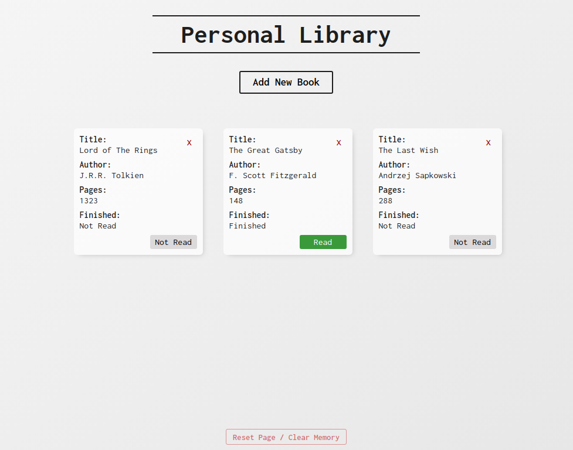
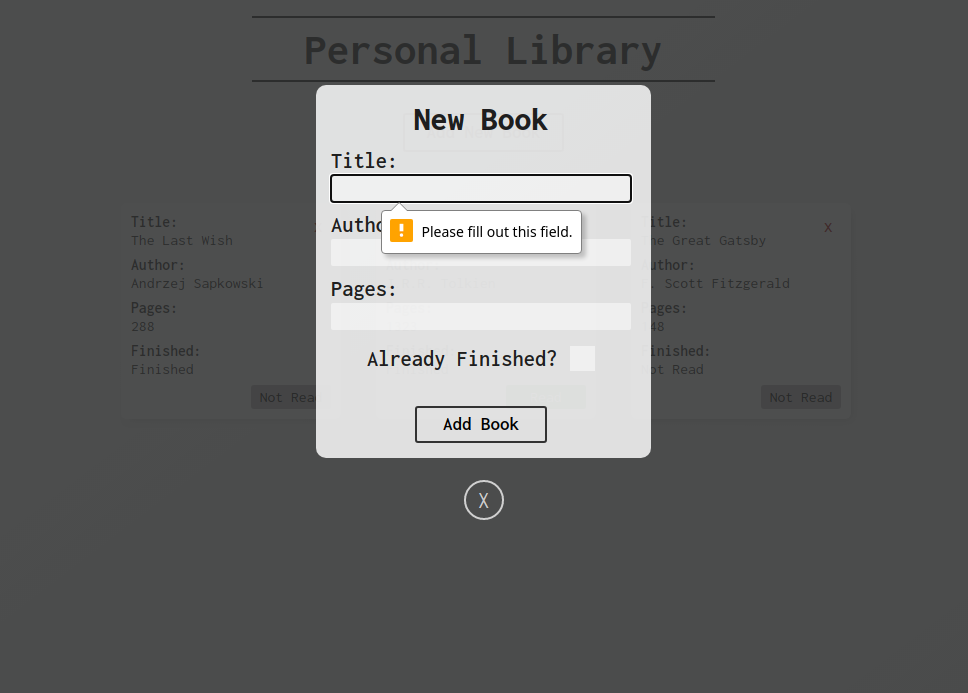

# Personal Library

A web application that displays and stores books for your own personal library. Robust features (described below) and minimal display to keep your book library clean and organized.

Note: Adding a book, or clicking existing book buttons will store book data in your local storage. I've included a reset/clear button at the bottom of the library to clear everything if desired.

[Try it out](https://jmilll.github.io/personal-library/)

## Example

[Try it out](https://jmilll.github.io/personal-library/)

## Features

* Personal library that will remember books added/removed after closing page.
* Minimal tile design with interactive elements.
* Option to change read status.
* Option to reset and clear local storage memory.

## Motivation

The purpose of this project was to learn and understand object oriented programming. Creating objects, storing them, and building with stored objects.

## Technologies Used

* JavaScript
* HTML / CSS

## Acknowledgements

This project was inspired by [The Odin Project](https://www.theodinproject.com/courses/javascript/lessons/library) online learning curriculum.

## License

MIT